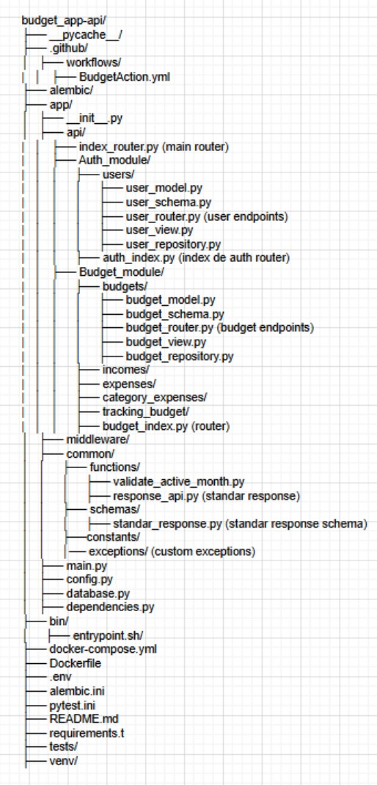

# Budget API

This is a Backend repository made on top of Python and FastAPI. 

This is a personal project made to showcase my skills with python as backend, is an open source code and  aim of the entire project is to create a "personal finance app" to manage your finance by butgets

## Installation

To run this project execute the following steps

Step 1: Clone the Repository

    git clone ["this repository link"]

Step 2: Create a Virtual Environment

    python -m venv venv

Step 3: Activate a Virtual Environment

on Windows:

    venv\Scripts\activate

on Linux/MacOs:

    source venv/bin/activate

Step 4: Install Dependencies

    pip install -r requirements.txt

Step 5: Run the Application

Move to the app/ directory:
    
    cd app/

Start the FastAPI development server:

    fastapi dev main.py
    
or

    uvicorn main:app --reload

    
## Running Unit Tests

To ensure that everything is working correctly, you can run the unit tests that have been set up.

Run All Tests
To run all the tests:

    pytest tests

Run a Single Test
To run a single test, for example, test_users.py:

    pytest tests/test_users.py

## Evironment Variables

HASHED PASSWORD && JWT SETTINGS

    SECRET_KEY=your_secret_key
    ALGORITHM=HS256
    ACCESS_TOKEN_EXPIRE_MINUTES=30

SMTP CREDENTIALS

    SMTP_SERVER=smtp.your_email_provider.com
    SMTP_PORT=587
    SMTP_USERNAME=your_email@example.com
    SMTP_PASSWORD=your_password
    EMAIL_FROM=your_email@example.com
    EMAIL_SUBJECT=Your account needs to be verified

DB CREDENTIALS

    USERNAME_DB=your_username
    PASSWORD_DB=your_password
    HOST_DB=your_host
    PORT_DB=your_port
    DATABASE_NAME=your_db_name

## Repository Architecture Based on Screaming Architecture.

In this project, the architecture is designed with a modular and layered approach, inspired by **Screaming Architecture**. This is not common in FastAPI projects, which makes this design stand out by focusing on a clear separation of concerns and domain-driven design.

### Layer 1: Root Level Structure

At the top level, the project is organized into essential directories and files that define the overall setup and tooling:

- `app/`: The main application logic and core functionalities.
- `alembic/`: Database migrations and versioning, handled by Alembic.
- `tests/`: Unit tests and integration tests for the application.
- `bin/`: Contains shell scripts like `entrypoint.sh` for Docker container orchestration.
- `docker-compose.yml`: Configuration for orchestrating services such as the database and the app.
- `Dockerfile`: Docker image configuration for running the FastAPI app.
- `.env`: Environment variables for configuring the application.
- `alembic.ini`: Configuration for Alembic migrations.
- `README.md`: Project documentation.
- `requirements.txt`: Python dependencies for the application.
- `venv/`: Virtual environment for Python dependencies (not always included in the repository).

### Layer 2: Application Layer (Inside `app/`)

The `app/` directory is where the core application logic lives:

- `main.py`: The main entry point for the FastAPI application.
- `database.py`: Handles database configuration and connections.
- `dependencies.py`: Contains shared dependencies injected into various parts of the application.
- `api/`: Houses the routers and endpoints for the application's modules.
- `common/`: Contains shared utility functions, schemas, and constants across the app.
- `middleware/`: Custom middlewares for handling requests, such as CORS, authentication, or logging.

### Layer 3: API Layer (Inside `api/`)

The `api/` directory defines individual modules of the application, each representing a core domain:

- `AUTH/`: Module for handling authentication and user management.
- `BUDGET/`: The module that handles all functionalities related to budgeting.
- `index_router.py`: The main router that connects all module routers to the FastAPI app.

### Layer 4: Domain Layer (Inside `BUDGET/`)

The `BUDGET/` module consists of submodules representing distinct features of the budgeting system:

- `incomes/`: Handles incomes management within a budget.
- `expenses/`: Manages expenses within a budget.
- `budgets/`: Contains logic to manage the overall budget.
- `budget_index.py`: Module-level router that connects all submodules' routers to the main `BUDGET/` module.

### Layer 5: Submodule Layer (Inside `incomes/`)

Each submodule (e.g., `incomes/`) contains its specific logic, broken down into further components:

- `income_model.py`: Defines the SQLAlchemy model for `Income`.
- `income_schema.py`: Pydantic schemas used for validation and serialization of `Income`.
- `income_router.py`: FastAPI router defining the endpoints related to `Income`.
- `income_view.py`: Contains business logic for handling income-related operations. This layer is equivalent to controllers or services in other frameworks like NestJS.
- `income_repository.py`: Implements the repository pattern, isolating data access logic for `Income`. It could evolve into a **CQRS (Command Query Responsibility Segregation)** pattern if needed in the future to handle more complex queries and commands.

This modular and layered architecture ensures scalability, maintainability, and testability, allowing each module and submodule to evolve independently while keeping a clear separation of concerns.

    

## 🚀 About Me
I'm a Python full stack developer... profiency using backend tools such as Django/ FastAPI, SQL and NoSQL Databases and AWS cloud compute.

Frontend skills all related to react ecosystem... React.js,Next.js, React Native, Redux and Zustand. 

